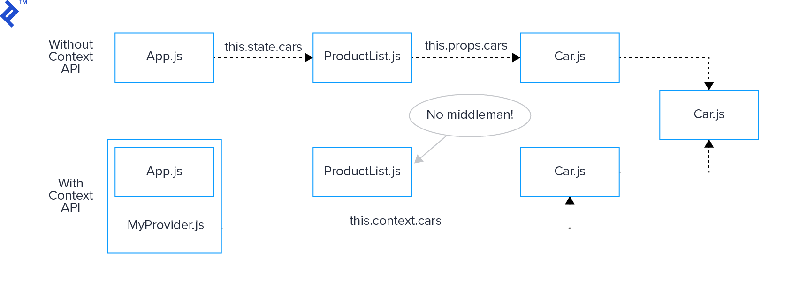
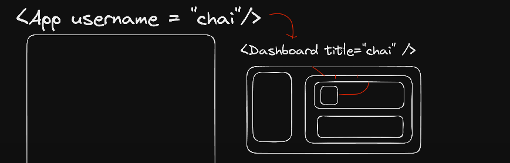
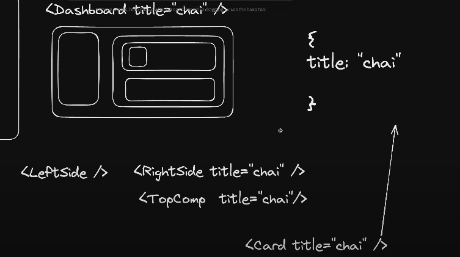

### React

-   React dom(for web app)
-   React native (for mobile app)

### Requirement

-   code editor
-   nodejs for enviroment (to execute the code)
-   react documentation : https://react.dev/

`npm` - node package manager : to install library or modules (insteller), install in system
`npx` - node package execution : execute without innstall in system

old method of create react app, it take time to install it is bulky(we may not require all things, what is provede when install) `npx create-react-app 01basicreact`

`npm run start` : to run the react code for developent reference for it:

```jsx
 "scripts": {
    "start": "react-scripts start",
    "build": "react-scripts build",
    "test": "react-scripts test",
    "eject": "react-scripts eject"
  },
```

`npm run build` : it create build folder all react code convert in js. in production we use build folder.

### Now we use Vite

`npm create vite@latest`

`create` is utility. utility code serves as a valuable toolbox, providing essential functions and tools that simplify common tasks.

```npm install` to install the dependancies, which is shown in package.json

## how to run the code

`npm run dev`

`npm run <base on script object key>`

```jsx
 "scripts": {
    "dev": "vite",
    "build": "vite build",
    "lint": "eslint . --ext js,jsx --report-unused-disable-directives --max-warnings 0",
    "preview": "vite preview"
  },
```

## File structure and code explain and naming convention

`package-lock.json` : lock stable the version of dependencies that need to run the project

"SPA" : react is single page application. we have only index file all manupulation will be here by using js dom manupulation

index.html `<div id="root"></div>`
|
|
App.js or Main.js

```jsx
import React from "react"; //core foundational library
import ReactDOM from "react-dom/client"; // implemenation in web of react
import App from "./App";

const root = ReactDOM.createRoot(document.getElementById("root"));
root.render(
    <React.StrictMode>
        <App />
    </React.StrictMode>
);
```

`ReactDOM` -react meke own dom and compare with browser dom and change accordingly
`createRoot` -make a root in , it expect id
`document.getElementById('root')` : search in html where the id="root"
`const root` : reference store in root variale
`root.render` : do a render in root, what inside it
`<App/>` : render the App fuction which reaturn the html code
`<React.StrictMode><App /></React.StrictMode>` it check only in development not in procution build

-   Extra Rendering: Components wrapped in <StrictMode> re-render an extra time to find bugs caused by impure rendering.
-   Effect Cleanup Check: Components within <StrictMode> re-run their effects an additional time to identify missing effect cleanup.
-   Deprecated API Warnings: Strict Mode checks for usage of deprecated APIs in your components.

We are not adding script in index.html, but how we are able to manipulate the dom? -->in backside react sript work or do ,

[but in vite add javascript tag in classical approach]()

### Rule of vite or traditonal react for function(component) or naming convention for componet

When making,import and use the function , write in Pacal case or capitalize App.jsx
standard practice for naming file: capitalize App.js (it work as in camel case in tradional react but not in vite it is like a rule in vite)

file extention in vite jsx(rule)

### Rule of jsx or js

we can export only one element practice put other element inside <></> it called fregment

```
if file return html extention in .jsx in not .js in traditional react
```

## Variable in Jsx

```jsx
function App() {
    const username = "Shankalpa";
    return (
        <>
            <Chai />
            <h1>react with {username}</h1>
        </>
    );
}
export default App;
```

` {username}` : it is javascrpt but we don't write direct javascrip here but write final outcome or result . It is `evaluated expression`

Why we can't write direct javascript ? Because at the end it change it as a object and this is not good practice write fuction or calulation in object. evalution or caluculation part **should write before return or outside the function**

```jsx
const anotherUser = "Shankalpa";
const reactElementc = React.createElement(
    "a",
    { href: "https://google.com", target: "_blank" },
    "Click me to  visit google ",
    anotherElement
); //output : Click me to visit google Shankalpa
```

## Custom React


## Babel

-   Tool that converts converts mordern js code in to older or traditional version of javascript , which is compatible in all browser.

-   **how it works** : It convert jsx(html-like syntax inside js) into regural js that react can understand.

example:

```jsx
// Input JSX code
const element = <h1>Hello, world!</h1>;

// Babel converts JSX into JavaScript
// Transpiled JavaScript code with Babel
const element = React.createElement("h1", null, "Hello, world!");
```

## React Hook

React Hook is function that allow to use state( current condition or data of a component at a particular point in time) and other react feature in function.

When something change in stage , it also chnage in ui also

```jsx
// without hook
function App() {
    const addValue = () => {
        counter += 1;
        console.log("Value added", Math.random());
        console.log("new counter", counter);
    };

    return (
        <>
            <h1>Chai aur react</h1>
            <h2>Counter value:{counter}</h2>
            <button onClick={addValue}>Add value</button>
            <br />
            <button>remove value</button>
        </>
    );
}

export default App;
```

Above code does't change the value of coutner in UI

Now it works:

```jsx
// with hook
mport { useState } from "react";

function App() {
    let [counter,setCounter]= useState (5)
    // let counter = 5;

    const addValue =()=>{
        counter=counter+1;
        setCounter(counter)
        console.log("Value added", Math.random())
        console.log("new counter",counter)
    }

    return (
        <>
            <h1>Chai aur react</h1>
            <h2>Counter value:{counter}</h2>
            <button onClick={addValue}>Add value</button>
            <br />
            <button>remove value</button>
        </>
    );
}
export default App;

```

### useState

` let [counter,setCounter]= useState (5)` : we can put any datatype in useState default value

we can name any name `let [counter,setCounter]`

## DOM

The Document Object Model (DOM) is a programming interface for web documents. It represents the structure of HTML and XML documents as a tree-like model where each node represents a part of the document.

The <html>, <head>, and <body> tags represent the root nodes of the document.

We access,manipulate element properties, create new elevent adn reove elements from the DOM using various methods like getElementById, getElementsByTagName, getElementsByClassName, and querySelector.....

-   `virtual dom` like : it wasn't there originally but bring it from anywhare on that place base on state

---

## React Fiber Architecture:

React fiber is the implementation of React core algorithm. It increase suitablility of area like animation, layout gesture. It's headline feature is incremental rendering(_the ability to split rendering work into chunks and spread it out over multiple frame_)

### What is Reconciliation?

The algorithm React use to difference one tree with another tree to determin which parts nedd to be changed.

**update** : A change in the data used to render a React app. Usually the result of `setState`. Eventully result in a re-render.

### Fiber

The primary goal of fiberis to enable React to take advantage of scheduling. We can able to do these work:

-   pause work and come back to it later
-   assign priority to different types of work
-   reuse previously compleed work.
-   abort work if it's no longer needed

[Click here to read more about it(github)](https://github.com/acdlite/react-fiber-architecture)

## `createRoot()`

It create a dom like structre behind the scenes. It create dom and compare to main dom and update in nessarry places of UI. Normally when browser reload all dom repaint again.  
_In virtual dom we can track the tree and replace the old value to change value only._

## Tailwind and Props in react js

`npm install -D tailwindcss postcss autoprefixer` D is devdepndencies

```jsx
"dependencies": {
    "react": "^18.2.0",
    "react-dom": "^18.2.0"
  },
  "devDependencies": {
    "@types/react": "^18.2.64",
```

[Tailwind documentation for vite](https://tailwindcss.com/docs/guides/vite)

### props handle

```jsx
function App() {
    const [count, setCount] = useState(0);
    let myObj = {
        username: "Shankalpa",
        age: 23,
    };
    let newArray = [1, 2, 3];

    return (
        <>
            <h1 className="bg-green-400 text-black p-4 rounded-xl mb-4">
                Tailwind test
            </h1>
            <Card
                username="chaiaurcode"
                someObject={myObj}
                someArray={newArray}
                btnText="click me"
            />
            <Card username="Shankalpa" btnText="visit me" />
        </>
    );
}
```

-   send can't send the Object directly as a variable add in {}

```jsx
function Card({username,btnText="visit me"}) {
    console.log(username)
```

To access the props:

-   Card(props) the props.username
-   Card({username, btnText}) the use directly {username}
-   in user didn't send the value of props use the default value like this : `{username,btnText="visit me"}`(standard approach) or `<div>{btnText || "Visit me"}`

## Interview

```jsx
function App() {
    let [counter, setCounter] = useState(5);
    // let counter = 5;

    const addValue = () => {
        if(counter<20){
            // counter = counter + 1;


            // it output is 6 not 9
            // setCounter(counter+1);
            // setCounter(counter+1);
            // setCounter(counter+1);
            // setCounter(counter+1);

            // now output is 9
            setCounter(prevCounter => prevCounter+1)
            setCounter(prevCounter => prevCounter+1)
            setCounter(prevCounter => prevCounter+1)
            setCounter(prevCounter => prevCounter+1)

        }
    };}
```

It is cause by useState, useState send update in batch all 4 setCounter(counter+1); be one batch, so it see all similar so execte only one. the is callback in setCounter. `setCounter(prevCounter => prevCounter+1)` prevCounter take last updated state and update it

## for component : https://www.devui.io/

## useCallback


`const ab = useCallback(function,dependencies) `

```jsx
const passwordGenerator = useCallback(() => {}, [
    length,
    numberAllowed,
    charAllowed,
    setPassword,
]);
```

It is used to optimize. It memorize the funtion.

## useEffect

when page load frist time it called and if any change in dependency it re-run


```jsx
useEffect(() => {
    passwordGenerator();
}, [length, numberAllowed, charAllowed, passwordGenerator]);
```

## useRef
### copy text clipboard
```jsx
const passwordRef = useRef(null)

 const copyPasswordToClipboard = useCallback(()=>{
      passwordRef.current?.select()
      // passwordRef.current?.setSelectionRange(0,3)
      window.navigator.clipboard.writeText(password)
    },[password])


<input
    type="text"
    value={password}
    className="outline-none w-full py-1 px-3"
    placeholder="password"
    readOnly
    ref={passwordRef}
/>

<button
onClick={copyPasswordToClipboard}
    className="outline-none bg-blue-700 text-white px-3 py-0.5 shrink-0">
                        copy
</button>
```


#### remenber the key in loop in react

```jsx
<form
    onSubmit={(e) => {
        e.preventDefault();
        convert()
       
    }}
>
```
using ```event.preventDefault()``` ensures that your custom behavior is executed when handling form submissions in React!

we can access object's element value like this ```res[currency]``` like list


### Export componenet 
Best practiece is maek a index.js in component folder and export from the there.  
```jsx
// index.html
import InputBox from './InputBox' //InputBox is component

export {InputBox}
```


## custom hook
good practice is export function
good practice of naming file and function of custom hook is use "use" infront of function
```jsx
// hooks/useCurrencyInfo
import { useEffect,useState } from "react";

function useCurrencyInfo(currency){
    const [data,setData] = useState({})
    useEffect(()=>{
        fetch(`https://cdn.jsdelivr.net/npm/@fawazahmed0/currency-api@latest/v1/currencies/${currency}.json`)
        .then((res)=>res.json())
        .then((res) => setData(res[currency]))
    },[currency])
    // console.log(data)

    return data
}

export default useCurrencyInfo;
```

## useId hook
```jsx
 const amountInputId = useId()
 <label htmlFor={amountInputId} className="text-black/40 mb-2 inline-block">
 <input id={amountInputId}>
```

### map,select and option
```jsx
 <select
    className="rounded-lg px-1 py-1 bg-gray-100 cursor-pointer outline-none" value={selectCurrency} onChange={(e) =>onCurrencyChange && onCurrencyChange(e.target.value)}
    disabled = {currencyDisable}
    >
        {currencyOptions.map((currency)=>(
            <option key={currency} value={currency}>{currency}</option>
        ))}
                
</select>
```
------------------------------------------------

07
## React Router
React router dom is 3rd party library

[React Router dom documentation](https://reactrouter.com/en/main/start/tutorial#setup)

```npm install react-router-dom```

Link and NavLink is by react router dom. ```import {Link,NavLink} from 'react-router-dom'``` . We use Link in place of <a> tag. When we use <a> tag whole page will be refresh. But we don't use refresh concept in react. 

Nav link is similar to Link but it rpovide some additional  things like is active


Normal flow or router:
```jsx
import Contact from './components/Contact/Contact.jsx'
import User from './components/User/User.jsx'
import Github, { githubInfoLoader } from './components/Github/Github.jsx'

// const router = createBrowserRouter([
//   {
//     path:'/',
//     element:<Layout/>,
//     children:[
//       {
//         path:"",
//         element:<Home/>
//       },
//       {
//         path:"about",
//         element:<About/>
//       }
//       
//     ]
//   }
// ])

const router = createBrowserRouter(
  createRoutesFromElements(
    <Route path="/" element={<Layout/>}>
      <Route path='' element={<Home/>}/>
      <Route path='about' element={<About/>}/>
      <Route path='contact' element={<Contact/>}/>
        <Route path='abc' element={<Abc/>}/> // /contact/abc
      <Route>
      <Route path='user/:userid' element={<User/>}/>
      <Route
      loader={githubInfoLoader}
       path='github' 
       element={<Github/>}
       />
    </Route>
  )
)

ReactDOM.createRoot(document.getElementById('root')).render(
  <React.StrictMode>
    <RouterProvider router={router} />
  </React.StrictMode>,
)
```

```RouterProvider``` is wrapper which wrap the  router. 
``` <Route path="/" element={<Layout/>}>``` Flollow the Layout on base url
```jsx
import React from 'react'
import Header from './components/Header/Header'
import Footer from './components/Footer/Footer'
import { Outlet } from 'react-router-dom'

const Layout = () => {
  return (
    <>
    <Header/>
    <Outlet/> //react router dom add the element base on condition
    <Footer/>
    </>
  )
}

export default Layout
```

then, base on path react render the element

```jsx
 <li>
    <NavLink
        to="/about"
        className={({isActive}) =>
                `block py-2 pr-4 pl-3 duration-200 ${isActive ?"text-orange-700":"text-gray-700" } border-b border-gray-100 hover:bg-gray-50 lg:hover:bg-transparent lg:border-0 hover:text-orange-700 lg:p-0`
                }
        >
        About
    </NavLink>
</li>
```

Where user click About it hit ```<Route path='about' element={<About/>}/>``` and add the AboutComponet in Outlet

### loader in route
```<Route loader={githubInfoLoader} path='github' element={<Github/>}/>``` first call the githubinLoader method and send Github componet. to use the reture value of method we need to use ```import { useLoaderData } from 'react-router-dom'``` 

```jsx
import React from "react";
import { useState } from "react";
import { useEffect } from "react";
import { useLoaderData } from "react-router-dom";

function Github() {
    // const [data,setData] = useState([])
    // useEffect(() => {
    //     fetch('https://api.github.com/users/ShankalpaPokharel')
    //     .then(response=>response.json())
    //     .then(data =>{
    //         console.log(data)
    //         setData(data)
    //     })

    // }, [])

    const data = useLoaderData();

    return (
        <div className="text-center m-4 bg-gray-600 text white p-4 text-3xl">
            Total public repo: {data.public_repos}
            
        </div>
    );
}

export default Github;

export const githubInfoLoader = async () => {
    const response = await fetch(
        "https://api.github.com/users/ShankalpaPokharel"
    );
    return response.json();
};

```

### quary or slug or url parameter
```<Route path='user/:userid' element={<User/>}/>```

to access the quary parmater we need the ```useParams``` hook of react router dom
```jsx
import { useParams } from 'react-router-dom'

function User() {
    const {userid}=useParams()
  return (
    <div className='mx-auto w-full max-w-screen-xl p-4 py-6 lg:py-8 bg-gray-600 text-white text-3xl text-center'>User : {userid}</div>
  )
}

export default User
```

-----------------------------------------------------------------------------

## Context API 
It provides a way to share data between components  without having pass props manually at every level of the component tree. It is primary used for share state that is ```considered global variable``` or shared across multiple components. While it is possible to create a separate file like global.js to store shared values, this approach is not practical because it does not synchronize well with the component state updates.  If we implement state using useState or any other variable, other parts of the application can update them directly, potentially leading to unexpected behavior and inconsistencies."



1. Context : create using ```React.createContext();``` method. This create a Context Object that contians a ```Provider``` and a```Consumer```. 

2. Provider: The ```provider component```  is used to wrap that part of the component where yuo what to the context available. It accept ```value``` prop, which can be any javascript value. This value will be passed down to all consumers within the provider's subtree. 

3.  Consumer : The consumer component is used to access the context value  passed down by a provider. 


#### State Management library
* context API(for react) 
* react Redux
* redux toolkit(RTK)(easier vsion of redux)
* zustand







Lets do it ....
make ```context``` folder 
and make ```UserContext.js```

```jsx
// context/UserContext.js
import react from 'react'
const UserContext = React.createContext()
export default UserContext;
```

Context give the provider. we use it as a wrapper. 

```jsx
<UserContext> //it become a porvider . Any component with in it get the access of UserContext 
<Login/>
<Card>
    <Data/>
</Card>
</UserContext>
```

Lets make a provider

```jsx
// context/UserContextProvider.jsx
import React from "react";
import UserContext from "./UserContext";

const UserContextProvider = ({children}) =>{
    const [user,setUser] = React.useState()
    return (
        <UserContext.Provider value={{user,setUser}}>//value is what {children} can access from it
        {children}
        </UserContext.Provider>
    )
}

export default UserContextProvider;

// childeren is generic name. whatever props came use it. we can name anyname to children no poblem. It is just for practiece. 
// name context folder is also standard practice put the folder name
```

Now Lets use it .....

### ```Where use it```

```jsx
// App.jsx
import { useState } from 'react'
import UserContextProvider from './context/userContextProdiver'

function App() {
  const [count, setCount] = useState(0)
  return (
    <UserContextProvider>
     <h1>React with Me</h1>
     <Login/>
     <Profile/>
    </UserContextProvider>
  )
}
export default App
// Here Login and Profile access the value value={{user,setUser}}
```

### ```How to use it(set)```
* import ```useContext``` hook and ```UserContext```
* ``` import UserContext from '../context/UserContext'```
* ``` const {setUser} = useContext(UserContext)``` take a UserContext in use Context to access or change
* ```setUser({username,password})```

```jsx
// src/Components/Login.jsx
import React,{useState,useContext} from 'react'
import UserContext from '../context/UserContext'

function Login() {
    const [username,setUsername] = useState('')
    const [password, setPassword] = useState('')
    const {setUser} = useContext(UserContext)

    const handleSubmit = (e)=>{
        e.preventDefault()
        setUser({username,password})
    }
  return (
    <div>
        <h2>Login</h2>
        <input type="text" value={username} onChange={(e)=>setUsername(e.target.value)} placeholder='username' />
        <input type="text" value={password} onChange={(e)=>setPassword(e.target.value)} placeholder='password' />
        <button onClick={handleSubmit}>Submit</button>
    </div>
  )
}

export default Login
```

### ```How to use it(access)```
* ```import UserContext from '../context/UserContext'```
* ```const {user}=useContext(UserContext)```
* ```<div>Wecome {user.username}</div>```

```jsx
import React, {useContext} from 'react'
import UserContext from '../context/UserContext'

function Profile() {
    const {user}=useContext(UserContext)
    console.log(user)
    if(!user) return <div>Please login</div>
    return <div>Wecome {user.username}</div>
}
export default Profile
```

### Dark Mode using context api

```jsx 
// 09themeswitcher/src/contexts/theme.js (do it same in production level)
import { createContext,useContext } from "react";

export const ThemeContext = createContext({
    themeMode:"light",
    darkTheme:()=>{},
    lighTheme:()=>{},
}) //we can add default variable , method 
export const ThemeProvider = ThemeContext.Provider //use for wrapper

// custom hook
export default function useTheme(){
    return useContext(ThemeContext)
}
```

### ```Where and how to use it as wrapper```

* ```import { ThemeProvider } from "./contexts/theme";```
* ```<ThemeProvider value={{themeMode,lightTheme,darkTheme}}> <ThemeBtn/><Card/></ThemeProvider>``` give with access of value

```jsx
if we use same name variable or method of ThemeContext in App.jsx, it automatically implement in in Thememode

const [count, setCount] = useState(0);
    const [themeMode,setThemeMode] = useState("light")
    const lightTheme = () =>{
      setThemeMode("light")
    }
    const darkTheme = () =>{
      setThemeMode("dark")
    }
```

```jsx
// App.jsx
import { useState,useEffect } from "react";
import "./App.css";
import { ThemeProvider } from "./contexts/theme";
import ThemeBtn from "./components/ThemeBtn";
import Card from "./components/Card";

function App() {
    const [count, setCount] = useState(0);
    const [themeMode,setThemeMode] = useState("light")
    const lightTheme = () =>{
      setThemeMode("light")
    }
    const darkTheme = () =>{
      setThemeMode("dark")
    }

    //actual change in  theme
    useEffect(() => {
      document.querySelector('html').classList.remove("light","dark")
      document.querySelector('html').classList.add(themeMode)
    }, [themeMode])
    

    return (
        <ThemeProvider value={{themeMode,lightTheme,darkTheme}}> 
            <div className="flex flex-wrap min-h-screen items-center">
                <div className="w-full">
                    <div className="w-full max-w-sm mx-auto flex justify-end mb-4">
                      <ThemeBtn/>
                    </div>

                    <div className="w-full max-w-sm mx-auto">
                      <Card/>
                    </div>
                </div>
            </div>
        </ThemeProvider>
    );
}

export default App;

```
### Toogle button(using useTheme hook of context api)
```jsx
import useTheme from "../contexts/theme"; //using useTheme hook of context api

export default function ThemeBtn() {
    const {themeMode,lightTheme,darkTheme}=useTheme()
    const onChangeBtn = (e)=>{
        const darkModeStatus=e.currentTarget.checked
        if(darkModeStatus) {
            darkTheme()
        }else{
            lightTheme()
        }
    }
    return (
        <label className="relative inline-flex items-center cursor-pointer">
            <input
                type="checkbox"
                value=""
                className="sr-only peer"
                onChange={onChangeBtn}
                checked={themeMode==="dark"}
            />
        </lable>
        )
}
```


Dark Mode tailwind config settings
```jsx
/** @type {import('tailwindcss').Config} */
export default {
  content: [
    "./index.html",
    "./src/**/*.{js,ts,jsx,tsx}",
  ],
  darkMode:"class", //imp
  theme: {
    extend: {},
  },
  plugins: [],
}

```


-----------------------------------------------------------------------------
## Redux Toolkit(RTK)
[Documentation](https://redux-toolkit.js.org/introduction/getting-started)
Redux :
    react-redux

like React      React native(mobile)
                React dom(web)
need both to use

Redux work all JS app not only in react

Development journey : Flux(devlop by FB) ---> redux (inspire by flux,better version of flux)  ---->redux-toolkit

### Concept 
* store : sigle source of truth(the state of your whole application is stored in a single object tree within a single store.)

state: current situation or condition of application data at paticular point in time. like value of variable at paticular point of that time


* reducers : a fuction that dedide how your application's state change in response to action sent to the Redux store. like normal  function which have (state,action) action have data, like normal parameter inside paranthesis. addTodo, removeTodo, editTodo every fuction are reducer which has specific task

* useDispatch : like messenger or mail-man, if we want to change in redux store, use use Dispatch. simply we add reducer in Dispatch. For example, if you want to add todo you would write down "add todo" and send it to the worker responsible for add todo (reducer).

* useSelector : use to access value of store

* Slice : In Redux Toolkit, we have tools like createSlice to help us create these slices more easily. It's like having a template for creating compartments in our big box. This template not only helps us create slices but also generates the workers (reducers) needed to manage the information inside those slices.

### Lets do ... 


* make a Slice ```reduxToolkitTodo/src/features/todo/todoSlice.js```
```jsx
import { createSlice,nanoid } from "@reduxjs/toolkit"; //nanoid to create unique id

const initialState = {
    todos: [{id:1,text:"Hello World"}]
}

export const todoSlice = createSlice({
    name:'todo',
    initialState,
    reducers:{
        addTodo: (state,action)=>{
            const todo = {
                id:nanoid(),
                text: action.payload
            }
            // state.todos.push(todo) //last index
            state.todos.unshift(todo) //fist index
        },
        removeTodo:(state,action)=>{
            state.todos = state.todos.filter((todo)=>todo.id !== action.payload)
        }
    }
})

export const {addTodo,removeTodo} = todoSlice.actions //this will import in add AddTodo component use with dispatch
export default todoSlice.reducer //this will import in store

action :  represents the action object dispatched to the store.
action.payload: contains the data associated with the action.

```

* create folder and file ```reduxToolkitTodo/src/app/store.js```

```jsx
import {configureStore} from '@reduxjs/toolkit' //from core redux not react redux
import todoReducer from '../features/todo/todoSlice'

export const store = configureStore({
    reducer:todoReducer //introduce reducer
//     reducer: {
//     counter: counterReducer,
//     // Add other reducers here if needed
//   },
})
//this will import and use as a wrapper
```

* Connecting Redux to your App (```dispatch```)
```jsx
import { useState } from 'react'
import {useDispatch} from 'react-redux' //imp
import { addTodo} from '../features/todo/todoSlice' //imp

function AddTodo() {
    const [input, setInput] = useState('')
    const dispatch = useDispatch() //imp

    const addTodoHandler = (e) =>{
        e.preventDefault()
        dispatch(addTodo(input)) //imp
        setInput('')
    }
  return (
    <form onSubmit={addTodoHandler} className="space-x-3 mt-12">
      <input
        type="text"
        className="bg-gray-800 rounded border border-gray-700 focus:border-indigo-500 focus:ring-2 focus:ring-indigo-900 text-base outline-none text-gray-100 py-1 px-3 leading-8 transition-colors duration-200 ease-in-out"
        placeholder="Enter a Todo..."
        value={input}
        onChange={(e) => setInput(e.target.value)}
      />
      <button
        type="submit"
        className="text-white bg-indigo-500 border-0 py-2 px-6 focus:outline-none hover:bg-indigo-600 rounded text-lg"
      >
        Add Todo
      </button>
    </form>
  )
}
export default AddTodo
```

* Connecting Redux to your App (```useSelector```)
```jsx
import { useDispatch, useSelector} from 'react-redux'
import { removeTodo } from '../features/todo/todoSlice'

function Todo() {
  const todos = useSelector(state => state.todos) //imp
  const dispatch = useDispatch()
    return (
    <>
    <div>Todos</div>
    <ul className="list-none">
        {todos.map((todo) => (
          <li
            className="mt-4 flex justify-between items-center bg-zinc-800 px-4 py-2 rounded"
            key={todo.id} //imp
          >
            <div className='text-white'>{todo.text}</div> //imp
            <button
             onClick={() => dispatch(removeTodo(todo.id))} //imp
              className="text-white bg-red-500 border-0 py-1 px-4 focus:outline-none hover:bg-red-600 rounded text-md">
            </li>
        ))} 
    <ul>
    )}    
```

* Wrapping Your App with Provider
```jsx
import React from 'react'
import ReactDOM from 'react-dom/client'
import App from './App.jsx'
import './index.css'
import { Provider } from 'react-redux'
import {store} from  './app/store.js' 

ReactDOM.createRoot(document.getElementById('root')).render(
  <Provider store={store}>
    <App />
  </Provider>,
)

```


