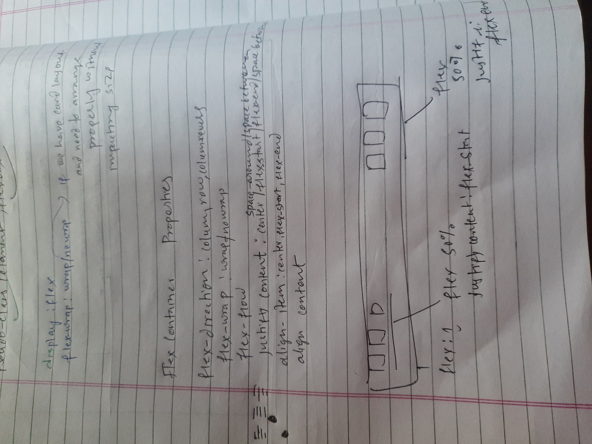

## Pseudo-classes

It apply secial effect on element. 

code example:
```
/* unvisited link */
a:link {
  color: #FF0000;
}

/* visited link */
a:visited {
  color: #00FF00;
}

/* mouse over link */
a:hover {
  color: #FF00FF;
}

/* selected link */
a:active {
  color: #0000FF;
}
```

## Pseudo-elements
used to style specified part of an element

```
selector::pseudo-element {
  property: value;
}
```

```
p::first-letter {
  color: #ff0000;
  font-size: xx-large;
}

p::first-line {
  color: #0000ff;
  font-variant: small-caps;
}
```

