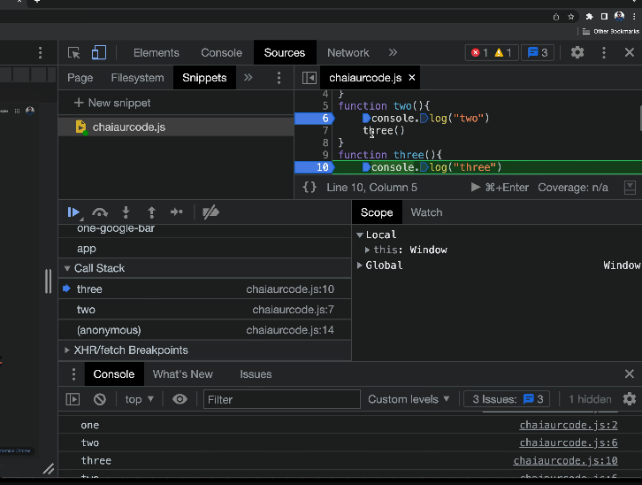

## DataType

1. Permitive Data Type : fundatamental building blocks provided by programming language. They represent simple value and have fixed size. 7 types: String, Number, Boolearn, null, undefine, symbol, BigInt

2. Non premitive Data Type( Reference types) : created by progrmmer , Array Object, Function


## Memonry
Stack(premitive),Heap(Non-premitive)


## Global and Local Scope

scope: {}
local : let,const
global: var 

```jsx
//global scope
let a = 10
const b = 20
var c = 30

console.log(a)
console.log(b)
console.log(c)

if (true){
  //local scope
  let d = 10
  const e = 20
  var f = 30
}
console.log(d) //d is not define
console.log(e) //e is not define
console.log(f) // 30
```

nested
```jsx
if (true) {
    const username = "hitesh"
    if (username === "hitesh") {
        const website = " youtube"
        // console.log(username + website);
    }
    // console.log(website);
}
// console.log(username);

// ++++++++++++++++++ interesting ++++++++++++++++++

console.log(addone(5))
function addone(num){
    return num + 1
}

addTwo(5) //errror 
const addTwo = function(num){
    return num + 2
}
```

### this

it refer to current context
```jsx
const user = {
    username: "shankalpa",
    price: 999,

    welcomeMessage: function() {
        console.log(`${this.username} , welcome to website`);
        console.log(this);
    }

}

// user.welcomeMessage()
// user.username = "sam"
// user.welcomeMessage()

// console.log(this); in nodej env {} but in browser window object
```

We can't use this in arrow function

## arrow function and normal fuction
```js
const addTwo = (num1,num2) => (num1+num2) //emplicept reacturn
const addTwo = (num1,num2) => num1+num2 //can't return obj here, to  do need to use()
const addTwo = (num1,num2) => {
  return num1+num2
}
```
* Normal function : decleare using funtion  keyword, enclose by curly braces, explicitly use the retun keyword to return value, this is binding

* Arrow function: no need for the function keyword or curly braces.Automatically return the result of the expression without using return but need to use return if using {}

## Immediately Invoked Function Expression(IIFE)
``` jsx
// Immediately Invoked Function Expressions (IIFE)

(function chai(){
    // named IIFE
    console.log(`DB CONNECTED`);
})();

( (name) => {
    console.log(`DB CONNECTED TWO ${name}`);
} )('hitesh')
```

## Javascrip execute code + call stack
Javascript execution context(how .js execute by javascript)

{} --> Global EC <--- this
|
|
--> Global Execution Context
|
|
--> Function Execution Context
|
|
-->Eval Execution Context

{}--> Memory Creation Phase
  --> Exection Phase





## Axios
It is commonly used for to communicate with web server to fetch data, submit for data, or perform other HTTP-reated task in javascript application. We can do ```get,post``` request using ```axious```. 

Code Example: 
Get
```
// Import Axios library
const axios = require('axios');

// Make a GET request to a URL
axios.get('https://api.example.com/data')
  .then(response => {
    // Handle successful response
    console.log('Data:', response.data);
  })
  .catch(error => {
    // Handle error
    console.error('Error:', error);
  });

```

Post
```
axios.post('https://api.example.com/data', { name: 'John', age: 30 })
  .then(response => {
    console.log('Data created:', response.data);
  })
  .catch(error => {
    console.error('Error:', error);
  });

```

### ```This``` keyword

It is used to refer object in, in save object. Example code:
```
const person={
    fname:"Shankalpa",
    lname:"Pokharel",
    fullname:function(){
        return this.fname+" "+this.lname
    }
}
```

### JS History
Same as click back and forward in browser. using ```history.back/forward()```. 
Code example
```
<html>
<head>
<script>
function goBack() {
  window.history.back()
}
</script>
</head>
<body>

<input type="button" value="Back" onclick="goBack()">

</body>
</html>

```


